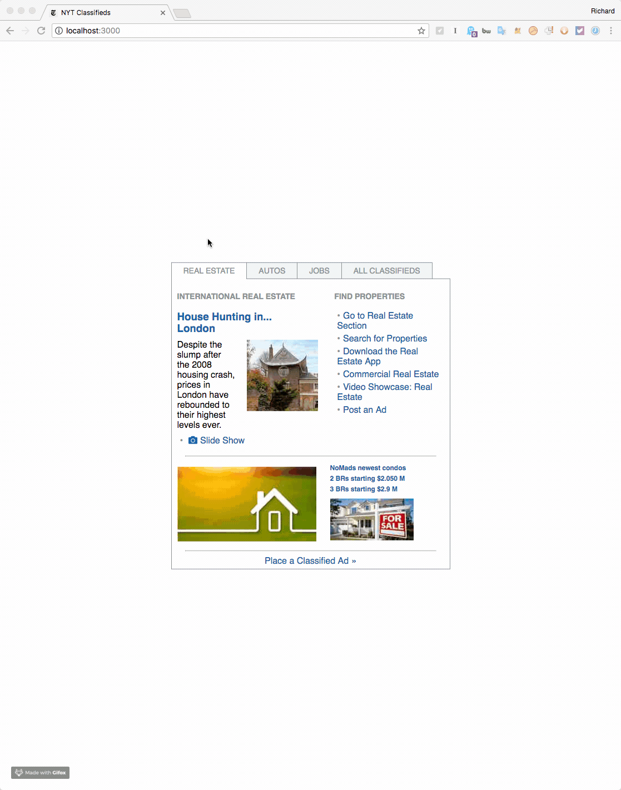

# Zscreen React

### Total Time Spent: ~3 hours

Overall, this was a lot of fun to work on. The biggest challenges that I came across had to do with styling the dangling border where the tabs are located and deciding how to render the images.

I wanted to put some thoughts down on my approach and some of the decisions that I made.

**Create React App**. I decided to use CRA to scaffold this because my assumption is that the intent of this screen is to show off my frontend skills and tooling would have complicated the matter. Using CRA let me focus on writing JS with React and CSS instead of tooling.

**Stateless Functional Components**. I used these wherever possible, and it turns out that the main App component was the only one that needed to maintain state

**No Redux**. It's a small app, there's only really one thing in the state, and so I decided to forego it.

**CSS**. It's in one file (**App.css**), imported into the App component. I suppose I could have split the CSS into smaller chunks related to each component, but I decided to stick with what CRA already gave me.

**Links**. I decided to make all the blue highlighted content not-clickable, opting to have CSS style it as a pointer. I did this because I felt it would let me focus more on the assignment at hand rather than try and curate too many links.

**Mock Data**. I ended up creating a file titled **fillerText** to encapsulate the mocked data being consume. I wasn't interested in hardcoding this data into each component and conditionally deciding which content to paint during that step, and I felt making an external call to a throwaway Firebase (or related) endpoint would have detracted from the time I could spend building the frontend.

**All Classifieds**. I decided to randomize the content in each component being rendered for this step instead of adding more components to the screen to show everything at once. This let me focus on the code I was already writing instead of toying around with new designs.

Subsequently, this specific part contained a decision to only re-render the sections if the tab being clicked on had changed from the active tab so that a user might not accidentally click on 'All Classifieds' a second time and have the randomized content change for them.

**The dangling border**. This took a bit of time to figure out, and I ended up hacking together an approach that added an "empty" tab to the end of the list and only displaying the bottom border for it. I also had to give this overall tab bar component a negative margin so it would connect with the rest of the classifieds section properly.

**Importing the images**. Part of the challenge here is with how CRA works with its images -- it's set to read from the `public` folder, and I didn't want to escape out of CRA and customize my build process to publish images to the `public` folder, nor did I want to directly save the images to that directory because I felt it may not be practical to bypass the existing build process.

My first instinct was to import the images as dependencies within the component, but I did not want to import each image into the component and then decide which one to use -- not practical. Instead, I used CSS to render the images and chose to use the filler text module to specify class names based on content.

Speaking of images, I also pre-optimized the images by sending them through an image editor and reducing their sizes to what I expected to render -- this was a small consideration for the end user when it comes to page load speeds. I exported to JPEG because it was the default option on my editor.